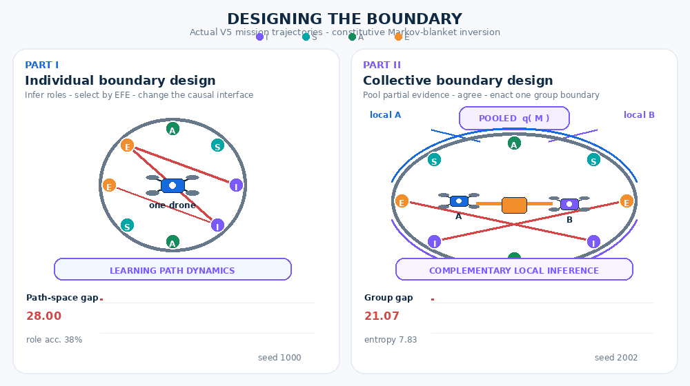

# Designing the Boundary

**Constitutive Markov-Blanket Inversion in Individual and Collective Drones**  
Luca M. Possati — V5.0

This repository is the complete computational companion to the paper. It asks whether a drone can do more than detect a Markov blanket: can it select interventions that **construct, stabilize, or transform** the causal organization that makes a blanket true?



*Representative successful frozen missions. Left: individual boundary construction. Right: collective boundary assembly through pooled evidence and bilateral action. The animation is generated from simulator records by `make_experiment_animation.py`.*

The implementation separates:

- `q_t(M)`: the agent's posterior over all 2,520 complete assignments of eight modules to internal, sensory, active, and external roles;
- `C_t`: the physical role map, drift matrix, precision vector, and unscreened links that generate trajectories.

A belief update changes only `q_t(M)`. A constitutive shield or routing action can change `C_t`.

## Two experiments

### Part I — individual boundary design

One drone learns its transition and intervention models online and scores motor and structural action jointly by expected free energy (EFE).

| Task | Constitutive | Diagnostic only |
|---|---:|---:|
| Construct | 95% | 0% |
| Stabilize | 95% | 0% |
| Transform | 100% | 0% |

Frozen evaluation: 20 paired seeds, six conditions, three tasks, 360 missions.

### Part II — collective boundary design

Two drones have complementary partial observations. They pool structural evidence into a group posterior and must issue matching design proposals. A unilateral proposal is causally inert. The collective blanket cuts across the two physical chassis.

| Task | Collective MB | Individual blankets | Equal-bandwidth communication |
|---|---:|---:|---:|
| Assemble | 80% | 25% | 0% |
| Repair | 90% | 15% | 0% |
| Reconfigure | 100% | 40% | 0% |

Frozen evaluation: 20 paired seeds, seven conditions, three tasks, 420 missions.

## Quick start

```bash
python -m pip install -r requirements.txt
python -m unittest discover -s tests -v

# Fast smoke runs
python run_experiment.py --quick --workers 4 --output quick_results
python run_collective_experiment.py --quick --workers 4 --output collective_quick_results

# Frozen paper benchmarks
python run_experiment.py --seeds 20 --seed-offset 1000 --workers 6 --output results
python analyze_results.py
python run_collective_experiment.py --seeds 20 --seed-offset 2000 --workers 6 --output collective_results
```

To compile the paper:

```bash
make paper
```

## Repository map

```text
active_drone/                 Core simulator, inference, policy, and graphics
  collective.py              Two-drone group-boundary model
run_experiment.py             Part I benchmark
run_collective_experiment.py  Part II benchmark
analyze_results.py            Extended Part I analysis and figures
make_experiment_animation.py  Data-driven GIF for both experiments
assets/                       Repository animation
tests/                        Ten invariant and smoke tests
results/                      Frozen Part I data and figures
collective_results/           Frozen Part II data and figures
paper/                        LaTeX source and compiled full submission
```

## What the model claims

Inside a declared state space and action repertoire, EFE-guided structural inference can be converted into causal boundary design. With distributed evidence and an irreducibly bilateral action rule, that logic can also constitute a task-relative group boundary whose maintenance improves strategic performance.

The collective result supports **operational collective individuation**, not the unrestricted ontological claim that two drones literally become one organism or person. Candidate modules, action types, communication topology, and the handshake institution are engineered. The simulator is linear-Gaussian and the hardware problem remains open.

## Design operations

- **Precision crafting** → selection, gating, routing, and calibration of sensory and active modules.
- **Curiosity sculpting** → structural perturbations selected through EFE.
- **Prediction embedding** → priors over complete role partitions and learned transition/intervention likelihoods.

## Reproducibility

Runs are deterministic conditional on seed. Every frozen output directory contains mission-level CSV, summaries, paired effects, metadata, and publication figures. The tests enforce the key discriminating invariants, including that unilateral collective action cannot alter the group boundary.

## Citation

See `CITATION.cff`. If you use the code or experiment, cite:

> Possati, Luca M. (2026). *Designing the Boundary: Constitutive Markov-Blanket Inversion in Individual and Collective Drones*. Version 5.0.

## License

MIT License. Copyright © 2026 Luca M. Possati.
